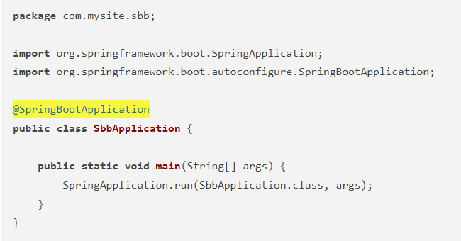

# 1주차, 프로젝트 warming up

<!-- 필수 항목 -->

## 프로젝트 소개

* 프로젝트명: challenge Us (가제)
* 서비스 특징: 친구들과 함께 도전 목표를 세우는 서비스
* 주요 기능
  - 계정 관리
  - 검색 기능
  - 뉴스피드 기능
* 주요 기술
  - Spring boot
  - Java, vue.js
  - REST API

<!-- 자유 양식 -->

## 프로젝트를 위해 공부한 사항
* Spring boot란?
 스프링부트(Spring Boot)는 자바의 웹 프레임워크로 기존 스프링(Spring) 프레임워크에 톰캣 서버를 내장하고 여러 편의 기능들을 추가하여 꾸준한 인기를 누리고 있는 프레임워크

* Spring boot가 각광받는 이유
   - WAS가 필요 없음!
 WAS : Web Application Server의 줄임말로, 웹 어플리케이션을 실행할 수 있는 서버
 
<!-- 자유 양식 -->

# WAS vs Web Server
* Web Server
  - 웹 브라우저 클라이언트로부터 HTTP 요청을 받아들이고 HTML 문서, css, js, 이미지와 같은 정적 컨텐츠를 반환하는 프로그램
 

* WAS
  - 인터넷 상에서 HTTP 프로토콜을 통해 사용자 컴퓨터나 장치에 애플리케이션을 수행해주는 미들웨어로서, 주로 DB와 함께 동적 서버 컨텐츠를 수행
  - 웹 서버 + 웹 컨테이너; 웹 서버 단독으로 처리할 수 없는 다양한 로직 처리가 필요한 동적 컨텐츠 제공
  ** Web container : 웹 서버가 보낸 jsp 등의 파일을 수행한 결과를 다시 웹 서버로 보내줌

# Springboot의 구조
* src/main/java 디렉터리
 - src/main/java 디렉터리의 자바 파일로는 스프링부트의 컨트롤러, 폼과 DTO, 데이터 베이스 처리를 위한 엔티티, 서비스 파일등이 있다.
 
* SbbApplication.java 파일
 - 모든 프로그램에는 시작을 담당하는 파일이 있다. 스프링부트 애플리케이션에도 시작을 담당하는 파일이 있는데 그 파일이 바로 <프로젝트명> + Application.java 파일이다. 스프링부트 프로젝트를 생성할때 "Sbb"라는 이름을 사용하면 다음과 같은 SbbApplication.java 파일이 자동으로 생성된다.

[파일명:/sbb/src/main/java/com/mysite/sbb/SbbApplication.java]

SbbApplication 클래스에는 위와 같이 반드시 @SpringBootApplication 애너테이션이 적용되어 있어야 한다. @SpringBootApplication 애너테이션을 통해 스프링부트의 모든 설정이 관리된다.

* templates 디렉터리
 - src/main/resources 디렉터리의 하위 디렉터리인 templates 디렉터리에는 템플릿 파일을 저장한다. 템플릿 파일은 HTML 파일 형태로 자바 객체와 연동되는 파일이다. templates 디렉터리에는 SBB의 질문 목록, 질문 상세 등의 HTML 파일을 저장한다.

* src/main/resources 디렉터리
 - src/main/resources 디렉터리는 자바 파일을 제외한 HTML, CSS, Javascript, 환경파일 등을 작성하는 공간이다.

* static 디렉터리
 - static 디렉터리는 SBB 프로젝트의 스타일시트(.css), 자바스크립트(.js) 그리고 이미지 파일(.jpg, .png) 등을 저장하는 공간이다.

* application.properties 파일
 - application.properties 파일은 SBB 프로젝트의 환경을 설정한다. SBB 프로젝트의 환경, 데이터베이스 등의 설정을 이 파일에 저장한다.

* src/test/java 디렉터리
 - src/test/java 디렉터리는 SBB 프로젝트에서 작성한 파일을 테스트하기 위한 테스트 코드를 작성하는 공간이다. JUnit과 스프링부트의 테스팅 도구를 사용하여 서버를 실행하지 않은 상태에서 src/main/java 디렉터리에 작성한 코드를 테스트할 수 있다.

* build.gradle 파일
 - 그레이들(Gradle)이 사용하는 환경 파일이다. 그레이들은 그루비(Groovy)를 기반으로 한 빌드 도구로 Ant, Maven과 같은 이전 세대 빌드 도구의 단점을 보완하고 장점을 취합하여 만든 빌드 도구이다. build.gradle 파일에는 프로젝트를 위해 필요한 플러그인과 라이브러리 등을 기술한다.

## 프로젝트 상세 설명

// 개발 환경, 기술 스택, 시스템 구성도, ERD, 기능 상세 설명 등

