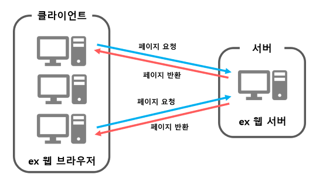

# 1주차, 프로젝트 warming up

<!-- 필수 항목 -->

## 프로젝트 소개

* 프로젝트명: challenge Us (가제)
* 서비스 특징: 친구들과 함께 도전 목표를 세우는 서비스
* 주요 기능
  - 계정 관리
  - 검색 기능
  - 뉴스피드 기능
* 주요 기술
  - Spring boot
  - Java, vue.js
  - REST API

<!-- 자유 양식 -->

## 프로젝트를 위해 공부한 사항
* Spring boot란?
 스프링부트(Spring Boot)는 자바의 웹 프레임워크로 기존 스프링(Spring) 프레임워크에 톰캣 서버를 내장하고 여러 편의 기능들을 추가하여 꾸준한 인기를 누리고 있는 프레임워크

* Spring boot가 각광받는 이유
 1. WAS가 필요 없음!
 WAS : Web Application Server의 줄임말로, 웹 어플리케이션을 실행할 수 있는 서버
 
<!-- 자유 양식 -->

# WAS vs Web Server
* Web Server
 - 웹 브라우저 클라이언트로부터 HTTP 요청을 받아들이고 HTML 문서, css, js, 이미지와 같은 정적 컨텐츠를 반환하는 프로그램
 

* WAS
 - 인터넷 상에서 HTTP 프로토콜을 통해 사용자 컴퓨터나 장치에 애플리케이션을 수행해주는 미들웨어로서, 주로 DB와 함께 동적 서버 컨텐츠를 수행
 - 웹 서버 + 웹 컨테이너; 웹 서버 단독으로 처리할 수 없는 다양한 로직 처리가 필요한 동적 컨텐츠 제공
 ** Web container : 웹 서버가 보낸 jsp 등의 파일을 수행한 결과를 다시 웹 서버로 보내줌

## 프로젝트 상세 설명

// 개발 환경, 기술 스택, 시스템 구성도, ERD, 기능 상세 설명 등

